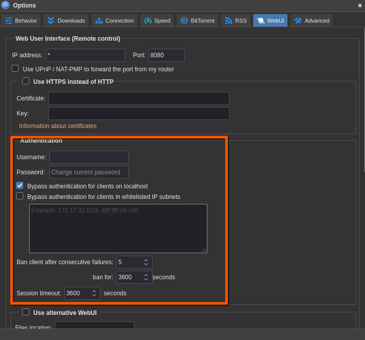
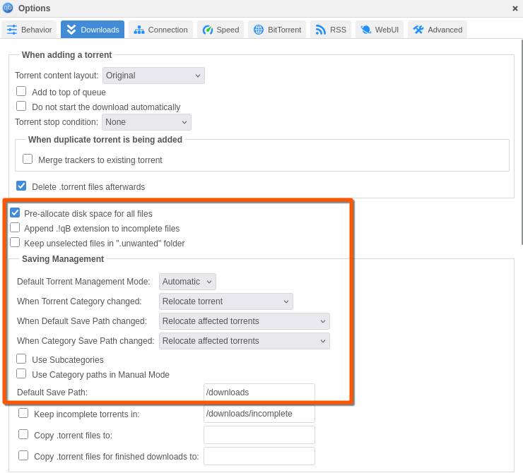
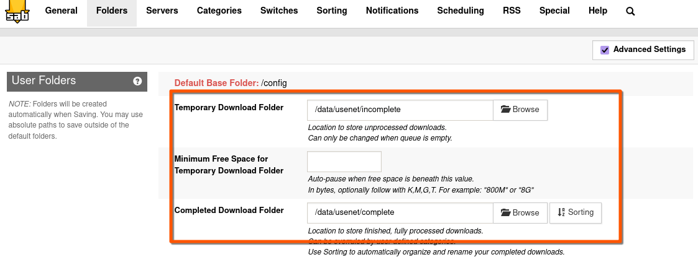
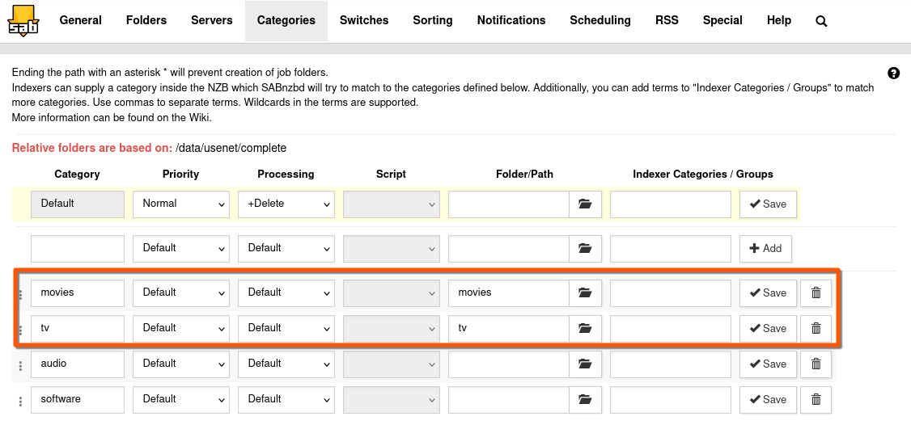
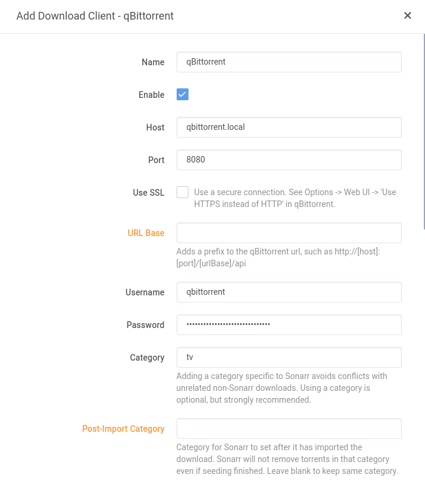
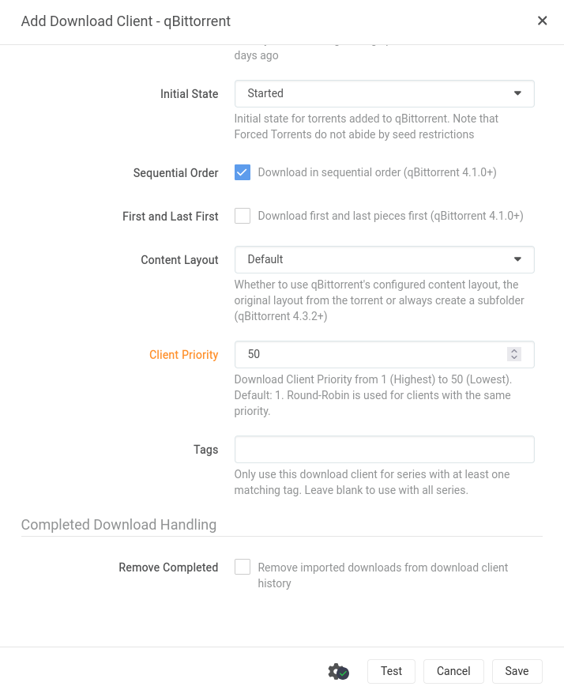
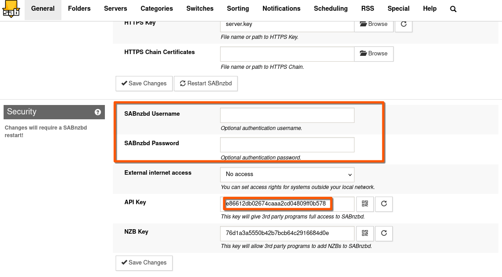
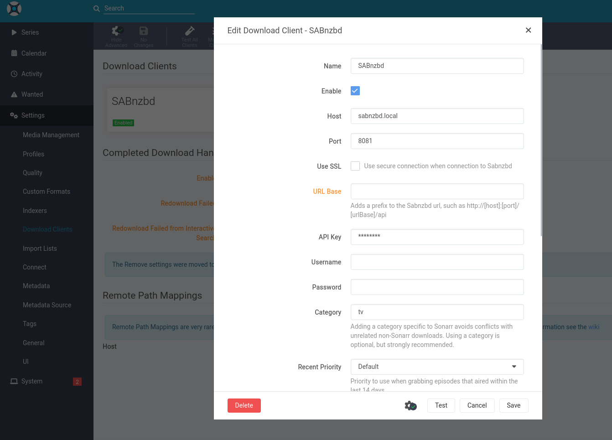
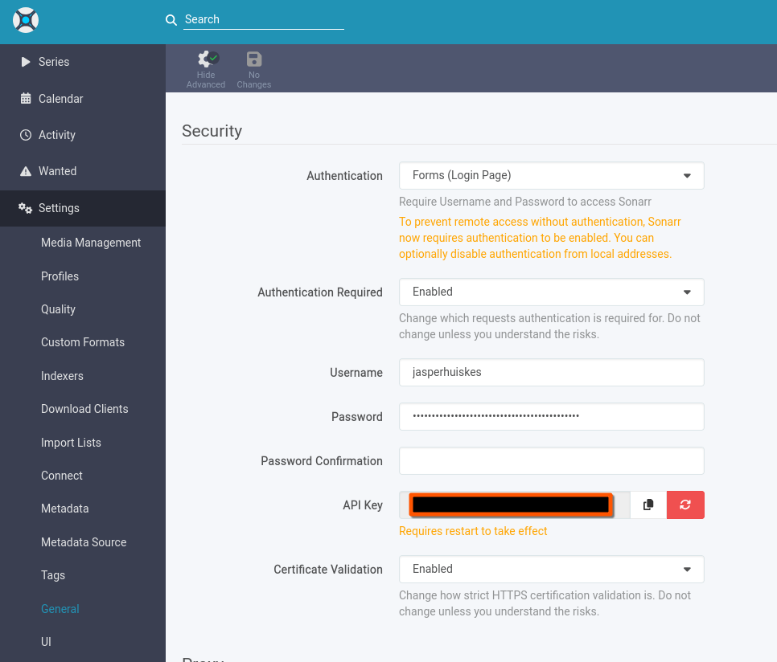
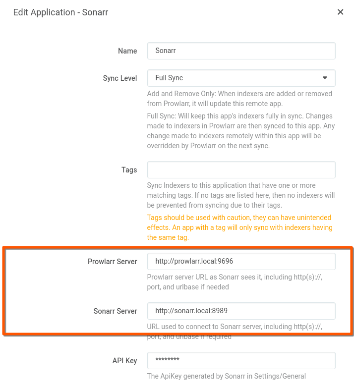

# Automated Home Media Server
## Features
A complete guide to setting up a home media server with automated requests/downloads
we will set up the following flow:
1. Allow users to request media via Seerr
2. Looking up indexers/trackers/RSS feeds via Prowlarr
3. Compare results to quality profiles imported via Configarr
4. Select best matching result (ie. Bluray 1080p) and add to download client via Sonarr/Radarr
5. Download movie/series via Qbittorrent/SABnzbd
6. Automatically look up subtitles & synchronise them with Bazarr
7. Move to Jellyfin library & add to Jellyfin
8. Give public access to Jellyfin with a secure reverse proxy via NPMplus + Crowdsec
9. Manage unwatched files & unwatched requests with Maintainarr

## Table of Contents
- [Automated Home Media Server](#automated-home-media-server)
  - [Table of Contents](#table-of-contents)
- [The Stack](#the-stack)
  - [Core software](#core-software)
  - [Downloading](#downloading)
  - [*arr Stack](#arr-stack)
  - [Optional software](#optional-software)
- [Basic installation](#basic-installation)
  - [Docker & Docker compose](#docker--docker-compose)
  - [User setup](#user-setup)
  - [File & Folder setup](#file--folder-setup)     

# The Stack
## Core software
**Docker** lets us run and isolate each of our services into a container. Everything for each of these services will live in the container except the configuration files which will live on our host.

**Jellyfin** is an open source media server. Clients aren't as flashed out compared to Plex, but it doesn't lock anyting (like transcoding) behind a paywall. There is a high variety of clients for Android TV / iOS / Android / PC

## Downloading
**qBittorrent** is a torrent client. Transmission and Deluge are also popular choices but I chose qBittorrent because you can easily configure it to only operate over the VPN connection.

**SABnzbd** is a usenet client. Usenet has my personal preference over torrent clients due to more consistent quality, unless you're using private trackers.

## *arr Stack
**[Sonarr](https://sonarr.tv/)** is a tool for automating and managing your TV library. It automates the process of searching for torrents, downloading them, and moving them to your library. It will also be able to check RSS feeds for information

**[Radarr](https://radarr.video/)** is a fork of Sonarr that does all the same stuff but for Movies.

**[Prowlarr](https://prowlarr.com/)** is a tool that Sonarr and Radarr use to search indexers and trackers for torrents and newsgroups.

**[Configarr](https://configarr.de/)** allows you to automatically synchronise quality profiles from TRaSH or create your own.

**[Bazarr](https://www.bazarr.media/)** automatically downloads and synchronises subtitles in your preferred language.

**[Seerr](https://github.com/seerr-team/seerr)** allows users to request media and automatically add it to Radarr/Sonarr.

**[Homepage](https://github.com/gethomepage/homepage)** is a dashboard for keeping track all of the services we're running.

**[Maintainarr](https://github.com/Maintainerr/Maintainerr)** is a great tool for removing media that hasn't been watched in a long while, or ones that were requested but never watched.

**[Unmanic](https://docs.unmanic.app/docs/)** is a tool to organise your library and remove unused subtitles and other things.

## Optional software
**[NPMPlus](https://github.com/ZoeyVid/NPMplus/)** is an improved fork of nginx Proxy Manager; a webui that allows you to run reverse proxies with automatic TLS certificate creation and renewal via Let's Encrypt

# Basic installation
## Docker & Docker compose
You need to install [Docker](https://docs.docker.com/engine/install/) & [Docker Compose](https://docs.docker.com/compose/install/) for your setup. Preferably use Docker Compose V2.
Both guides on the Docker website should be sufficient for you to install it.

## User & Group setup
An often overlooked part of the *arr stack is that it works best with individual users per app; that way you can give folder permissions (chown) only where they're needed. For our stack we will be starting our ID's for users at 13000. We will be be creating a new user called `mediauser` that we will use to create all folders and to run Docker Compose. Ideally we don't want to run this as root, for security purposes

Run the following code to create all `users` and a usergroup for them; `mediacenter`
```
sudo groupadd mediaserver -g 13000
sudo useradd mediauser -u 13000
sudo useradd qbittorrent -u 13001
sudo useradd sabnzbd -u 13002
sudo useradd sonarr -u 13003
sudo useradd radarr -u 13004
sudo useradd prowlarr -u 13005
sudo useradd configarr -u 13006
sudo useradd bazarr -u 13007
sudo useradd seerr -u 13008
sudo useradd homepage -u 13009
sudo useradd maintainarr -u 13010
sudo useradd unmanic -u 13011
```

Then we want to add all users to the mediacenter group and add our mediauser to the docker group, so it can access the docker repositories:
```
sudo usermod -a -G mediaserver mediauser
sudo usermod -a -G docker mediauser
sudo usermod -a -G mediaserver qbittorrent
sudo usermod -a -G mediaserver sabnzbd
sudo usermod -a -G mediaserver sonarr
sudo usermod -a -G mediaserver radarr
sudo usermod -a -G mediaserver prowlarr
sudo usermod -a -G mediaserver configarr
sudo usermod -a -G mediaserver bazarr
sudo usermod -a -G mediaserver seerr
sudo usermod -a -G mediaserver homepage
sudo usermod -a -G mediaserver maintainarr
sudo usermod -a -G mediaserver unmanic
```
## Configure mediauser
Now we want to create a password for `mediauser`, do: `sudo passwd mediauser`. This will prompt you for a new password.
Then we want to allow the `mediauser` to do sudo so do: `sudo adduser mediauser sudo`.

Finally we want to create a home folder for the `mediauser`: `sudo mkhomedir_helper mediauser`

Now reboot your machine.

## File & Folder setup
For the file and folder structure, we are using [TRaSH Guides' setup on file & folder structure](https://trash-guides.info/File-and-Folder-Structure/), the folder structure will look something like: 
```
config
├── qbittorrent
├── sabnznbd
├── etc.
data
├── torrents
│   ├── movies
│   └── tv
├── usenet
│   ├── incomplete
│   └── complete
│       ├── movies
│       └── tv
└── media
    ├── movies
    └── tv
```

## Creating Folders
First we need to decide where you want the Docker containers and their config files to live. I would personally recommend either `/opt`. In this guide we will be using `/opt` as base, where we will create a `mediaserver` folder.
**Please note** if you're using an external NAS, you will have to edit your `/etc/fstab` first and permanently mount the volumes. Use that mountpoint for the /data/ folders. I would personally recommend keeping the config files and transcode cache on an SSD ([as per Jellyfin recommendations](https://jellyfin.org/docs/general/administration/hardware-selection#storage))

Make sure you're logged in as the user `mediauser` we've previously set up by doing: `login mediauser`. Also make sure you are using `bash` for all commands to work.

Create the folder structure by entering the following commands:
```
sudo mkdir -pv /opt/mediaserver/config/{jellyfin,qbittorrent,sabnzbd,sonarr,radarr,prowlarr,configarr,bazarr,seerr,homepage,maintainarr,unmanic}
sudo mkdir -pv /opt/mediaserver/data/{torrents,media}/{movies,tv}
sudo mkdir -pv /opt/mediaserver/data/usenet/incomplete
sudo mkdir -pv /opt/mediaserver/data/usenet/complete/{movies,tv}
```
### Other media location
If you're using an external mount point, you will have to adjust the /data/ folders to the mountpoint you've specified in your `/etc/fstab`. For example, we're using the `media` mounted in `mnt` here, while omitting the data folder.
```
sudo mkdir -pv /mnt/media/data/{torrents,media}/{movies,tv}
sudo mkdir -pv /mnt/media/data/usenet/incomplete
sudo mkdir -pv /mnt/media/data/usenet/complete/{movies,tv}
```

## Folder permissions
Remember to adjust the lines that refer to your `data` location if you're not using the default location of `/opt/mediaserver`
```
sudo chmod -R a=,a+rX,u+w,g+w /opt/mediaserver
sudo chown -R $USER:$USER /opt/mediaserver
sudo chown -R qbittorrent:mediaserver /opt/mediaserver/config/qbittorrent
sudo chown -R qbittorrent:mediaserver /opt/mediaserver/data/torrents
sudo chown -R sabnzbd:mediaserver /opt/mediaserver/config/sabnzbd
sudo chown -R sabnzbd:mediaserver /opt/mediaserver/data/usenet
sudo chown -R sonarr:mediaserver /opt/mediaserver/config/sonarr
sudo chown -R sonarr:mediaserver /opt/mediaserver/data/tv
sudo chown -R radarr:mediaserver /opt/mediaserver/config/radarr
sudo chown -R radarr:mediaserver /opt/mediaserver/data/movies
sudo chown -R prowlarr:mediaserver /opt/mediaserver/config/prowlarr
sudo chown -R configarr:mediaserver /opt/mediaserver/config/configarr
sudo chown -R bazarr:mediaserver /opt/mediaserver/config/bazarr
sudo chown -R seerr:mediaserver /opt/mediaserver/config/seerr
sudo chown -R homepage:mediaserver /opt/mediaserver/config/homepage
sudo chown -R maintainarr:mediaserver /opt/mediaserver/config/maintainarr
sudo chown -R unmanic:mediaserver /opt/mediaserver/config/unmanic
```

## Docker Compose File
Now that all file and folder permissions are set up we want to set up our docker compose file. The location for this file will be in our home folder `/home/mediauser` for ease of use.
Just do `nano compose.yaml` and copy and past the contents of [this file](/compose.yaml)

# Application installation
Launch all our Docker containers by doing `docker compose up -d`. It will now start pulling all images automatically. We will move on to configure every app individually

## qBittorrent
Access the WebUI (default port 8080). It will automatically create a password for you that you can access by doing `docker logs qbittorrent`. The output will have your password in it.
<details>
  <summary>Screenshot</summary>
  
  
</details>

### Admin Account
Change your default login details. For security sake, change both the admin login and the password. Optionally you can allow `bypass authentication for local clients` or setup whitelisted IPs. 
<details>
  <summary>Screenshots</summary>
  
  
</details>

### Downloading setup
Set up the Downloads tab with the following options
* Do not enable pre-allocating disk space when you're using unRaid with a cache drive
* Change details as you want, but these settings minimise disk IO since qBittorrent doesn't support atomic moves
<details>
  <summary>Screenshots</summary>
  
  
</details>

These are the default settings to make qBittorrent work. If you want more detailed information, I highly recommend visiting [TRaSH Guides' section on qBittorrent](https://trash-guides.info/Downloaders/qBittorrent/Basic-Setup/).

## SABnzbd
Access the WebUI (default port 8081). Set up your news server, then in the user folders:
- Set your temporary download folder to `/data/usenet/incomplete`
- Set your completed download folder to `/data/usenet/complete`
<details>
  <summary>Screenshots</summary>
  
  
</details>

Then we want to navigate to the categories tab and change our folder/paths for:
- TV
- Movies
- And add a 'category' for Prowlarr, just in case
<details>
  <summary>Screenshots</summary>
  
  
</details>

Further reading and information can be gotten from [TRaSH Guides' article on SABnzbd](https://trash-guides.info/Downloaders/SABnzbd/Basic-Setup/)

## Sonarr, Radarr & Prowlarr
For Sonarr, Radarr and Prowlarr setup will be almost identical. Access the WebUI (default port 8989, 7878 & 9696). Set up a user account that you want to login/edit with.

### Download clients
Set up the download clients by going to `Settings -> Download Clients -> + icon`. Add both qBittorrent and SABnzbd here.

#### Qbittorrent
Change the following settings based on personal preference.
- Category to `tv` to be consistent across the board
- Download in sequential order in order to prioritise the first episodes/movies
- Client priority is set to 50 (lowest) for me, since I prefer newsgroups
- Remove completed is unchecked for me since Prowlarr will have ratio's set up
<details>
  <summary>Screenshots</summary>
  
  

  
</details>

#### SABnzbd
You will need to set the following:
- Obtain your API key from SABnzbd in `General Settings -> Security`
- Optionally you can create a user account here for your SABnzbd setup (recommended)
- Change port to 8081
- Client priority to 1

<details>
  <summary>Screenshots</summary>

  
  
  
</details>

### Client sync
We want to synchronise Prowlarr with Sonarr & Radarr. To do this go to `Settings -> Apps` in the Prowlarr settings. Then set the following values
- Prowlarr server: `http://prowlarr.local:9696`
- Sonarr server: `http://sonarr.local:8989`
- API key: get this from your Sonarr/Radarr installation by navigating to `Settings -> General -> Security` (see screenshot)
<details>
  <summary>Screenshots</summary>

  
  
  
</details>

### Indexer setup
For indexers there are different types. There are 2 types you will want:
- Torrent trackers
- Newsgroup trackers
For both there are a lot of different providers. If you're just starting out with downloading, it will be almost impossible to be a part of a Private Torrent tracker, as most of those are based on merits, e.g. how much you upload. Private newsgroup trackers usually provide access for a fee.
- A good starting point for Newsgroup trackers is (https://www.reddit.com/r/usenet/).
- A good starting point for Private torrent trackers is (https://www.reddit.com/r/OpenSignups/).

**NPMPlus + Crowdsec**
Use the following whitelist:
```
name: crowdsecurity/jellyfin-whitelist
description: "Whitelist events from jellyfin"
filter: "evt.Meta.service == 'http' && evt.Meta.log_type in ['http_access-log', 'http_error-log']"
whitelist:
  reason: "Jellyfin whitelist"
  expression:
   - evt.Meta.http_status == '403' && evt.Meta.http_verb == 'POST' && evt.Meta.http_path matches '^/Sessions/Playing/Progress$' # When playing videos
   - evt.Meta.http_status == '404' && evt.Meta.http_verb == 'GET' && evt.Meta.http_path matches '(?i)^/items/([a-z0-9\\-]+)/images/(thumb|primary)' # When brow>
   - evt.Meta.http_verb == 'GET' && evt.Meta.http_path contains '/HomeScreen/CachedImage/' # When using Custom Home Sections plugin with Jellyseerr integration
```
